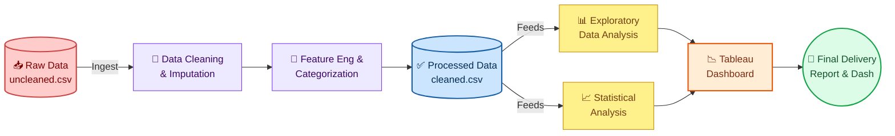
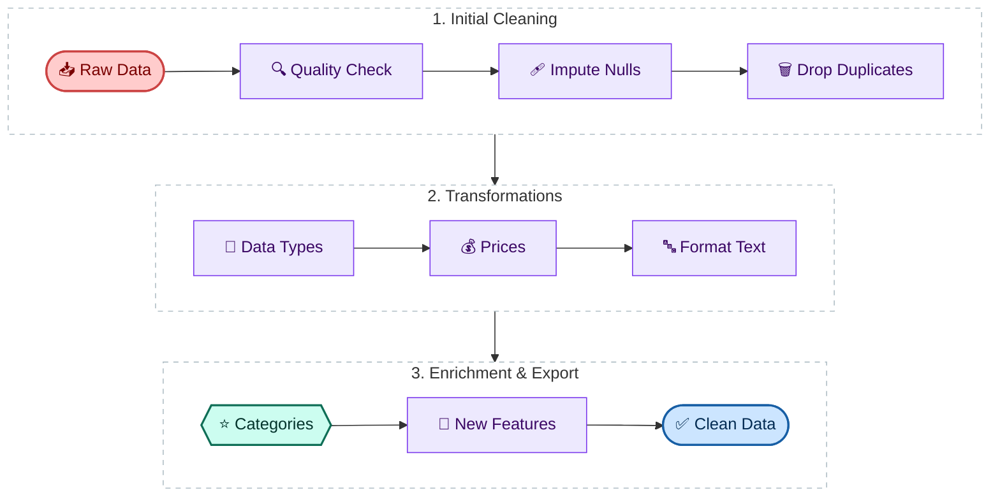
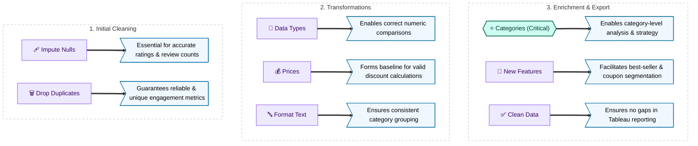

<div align="center">
  
</div>

<h1 align="center">Amazon Electronics Market Intelligence</h1>
<h2 align="left">DVA Capstone 2 — Group E_G1</h2>


> **Identifying which Amazon Electronics product categories deliver the highest customer value**
> — through discount analysis, rating quality, and review engagement.

---

## 📌 Problem Statement

Which product categories on Amazon Electronics perform best in terms of:
- 🌟 **Customer satisfaction** (ratings)
- 💬 **Engagement** (review count)
- 🏷️ **Pricing strategy** (discount levels)

This project enables **data-driven decisions** for pricing optimization, product positioning, and category-level strategy.

---


## 📁 Repository Structure

```text
E_G1_DVACapstone2/
├──  DVA-focused-Portfolio
├── DVA-oriented-Resume
├── data/
│   ├── raw/                        # Raw scraped dataset (never edited)
│   └── processed/                  # Cleaned, analysis-ready dataset
├── docs/
│   └── data_dictionary.md          # Schema, rules & data quality notes
├── notebooks/
│   ├── 01_extraction.ipynb
│   ├── 02_cleaning.ipynb
│   ├── 03_eda.ipynb
│   ├── 04_statistical_analysis.ipynb
│   └── 05_final_load_prep.ipynb
├── reports/
│   ├── presentation.pdf
│   └── project_report.pdf
├── scripts/
│   └── etl_pipeline.py
├── tableau/
     ├── dashboard_links.md
     └── screenshots/

```

---

## 🔄 Project Workflow



## 🛠️ Full Data Cleaning Pipeline



<br>

### 🎯 Why Each Step Matters



---

### Pipeline Steps Summary

| Step | What Happens |
|------|-------------|
| 🔍 **Extraction** | Ingest raw CSV without modification |
| 🧹 **Cleaning** | Remove duplicates, fix types, parse text numerics |
| 💰 **Price Processing** | Resolve & impute listed/current price, filter outliers |
| 🏷️ **Category Derivation** | Keyword-based engine → `product_category` column |
| 🔧 **Feature Engineering** | Binary flags: `is_best_seller`, `has_coupon`, `is_sponsored`, `is_sustainable` |
| 🔁 **Null Imputation** | Semantic fallbacks for string columns |

### Run Locally

```bash
git clone https://github.com/Aman739-code/E_G1_DVACapstone2
cd E_G1_DVACapstone2
pip install -r requirements.txt
python scripts/etl_pipeline.py
```

> Output: `data/processed/cleaned_data.csv`

---

## 📓 Notebooks

| # | Notebook | Purpose |
|---|----------|---------|
| 01 | `01_extraction.ipynb` | Initial data exploration |
| 02 | `02_cleaning.ipynb` | Cleaning prototype (automated in etl_pipeline.py) |
| 03 | `03_eda.ipynb` | Distributions, trends, correlations |
| 04 | `04_statistical_analysis.ipynb` | Statistical testing & significance |
| 05 | `05_final_load_prep.ipynb` | Final validation before Tableau load |

---

## 📊 Tableau Dashboard

🔗 **[Amazon Electronics Market Intelligence Dashboard](https://public.tableau.com/app/profile/aman.bhatnagar7387/viz/AmazonElectronicsMarketIntelligenceDashboard/Dashboard1)**

---

## 📚 Documentation

- [`docs/data_dictionary.md`](docs/data_dictionary.md) — Full schema & transformation rules
- [`reports/project_report.pdf`](reports/project_report.pdf) — Detailed findings

---


## 👥 Team Contribution Matrix

| Team Member | Primary Role | Deliverables |
| :--- | :--- | :--- |
| **Aman** | Project Lead, Visualisation Lead | Repo setup, timeline management, submission compliance, Gate 1, KPIs, Tableau dashboard |
| **Adnan Rizvi** | ETL Lead, Quality Lead | Engineered a production-grade ETL pipeline, restructured the repo |
| **Bhoomi Chhikara** | ETL Lead, Analysis Lead | Notebook 01 and 03 - Extraction and EDA |
| **Mouli Srivastava** | Analysis Lead, Report Lead | Notebook 04 - Statistical Analysis, Final Report PDF, contribution matrix |
| **Gauri Mishra** | Report Lead | Prepared the Report PDF |
| **Prashant Raj** | PPT Lead | Designed and structured the final presentation deck |
| **Swagato Bauri** | Documentation Lead | Documented the process in Readme.md, Notebook 05 - Final_load_prep |

<br>

<div align="center">

</div>

---

*DVA Capstone 2 — Group E_G1 | Data Visualization & Analytics*
